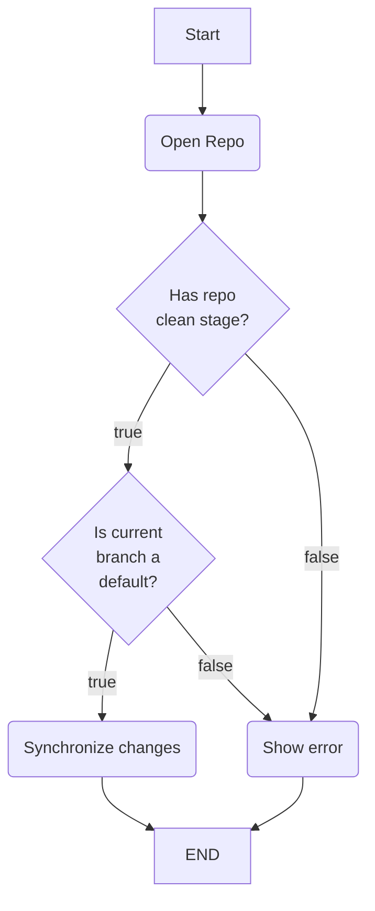

# gitsynchro

1. _As an developer I want to automatically push the default branch to somewhere else._
2. _As an developer I want to automatically push all tags to somewhere else._



## ToDos

- Fetch changes from "origin"
- Push Tags: <https://github.com/go-git/go-git/blob/35f7e6770361a2c16c9b6c44acdc38ae04c75bd3/_examples/tag-create-push/main.go#L128C6-L132>
- Generate JSON Schema for configuration
- Double check disabled linters

## Config Locations

The application will look for the application in under the following paths:

- `$HOME/gitsynchro.yaml`
- `$HOME/gitsynchro/gitsynchro.yaml`
- `./gitsynchro.yaml`

In advance it's possible to specify a custom path. You just need to specify the path as an command line flag like this: `--config my-path/whatever.yaml`

## Configuration

```yaml
repos:
  - name: very-good-repo
    path: /tmp/test
    defaultBranch: main
    destinations:
      - remoteName: test
```
