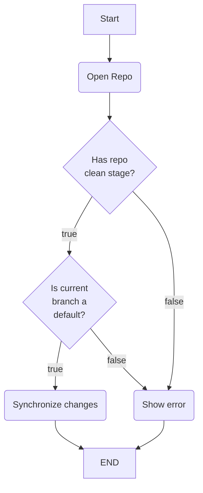

# The flow

```mermaid
flowchart
    Start --> openRepo(Open Repo)
    openRepo --> IsClean{Has repo\nclean stage?}
        IsClean -- true --> IsDefaultBranch{Is current\n branch a\n default?}
            IsDefaultBranch -- true --> SyncChanges(Synchronize changes)
                SyncChanges --> END
            IsDefaultBranch -- false --> ShowError(Show error)
        IsClean -- false --> ShowError
    ShowError --> END
```
